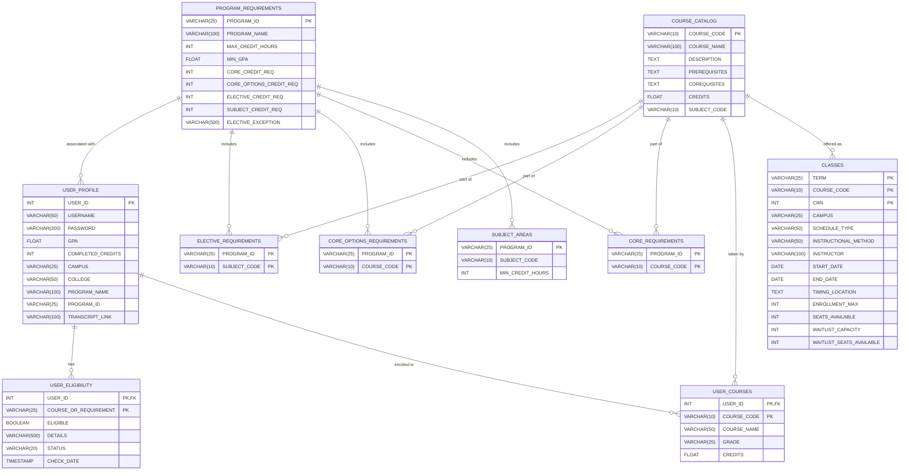
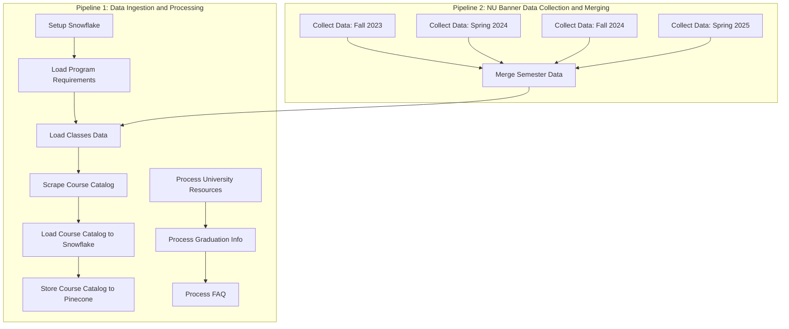
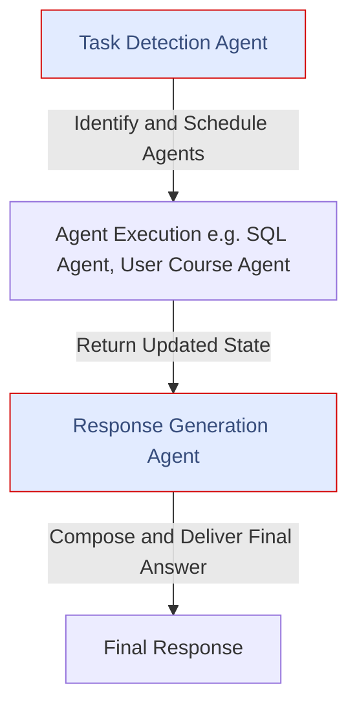
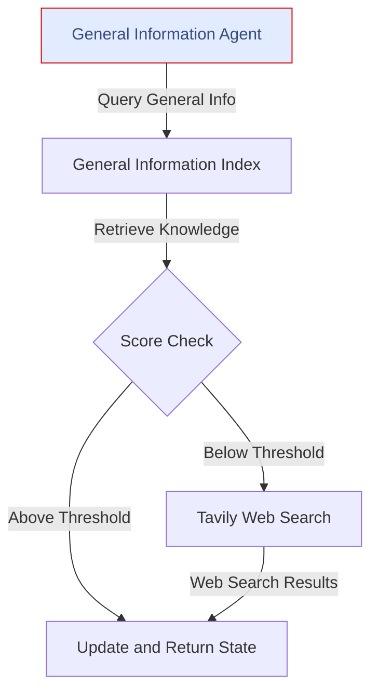
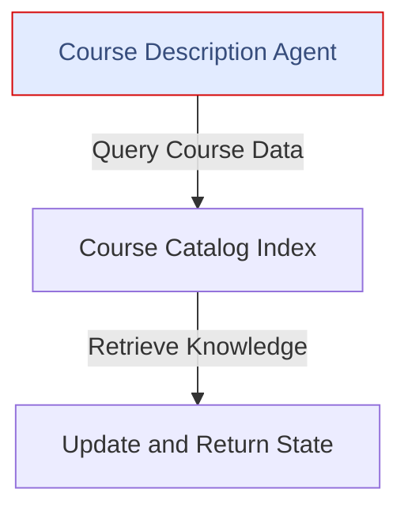
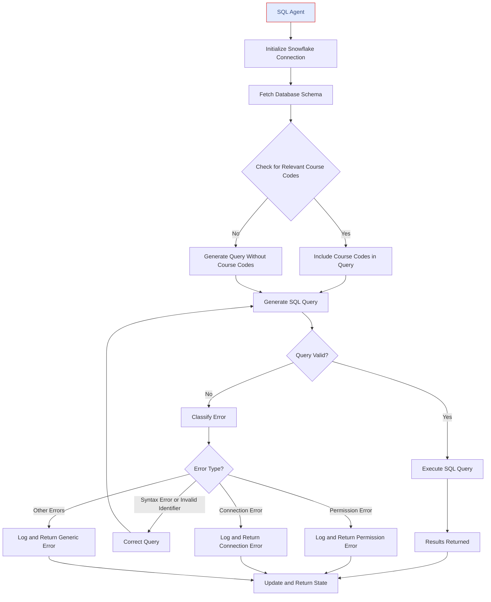
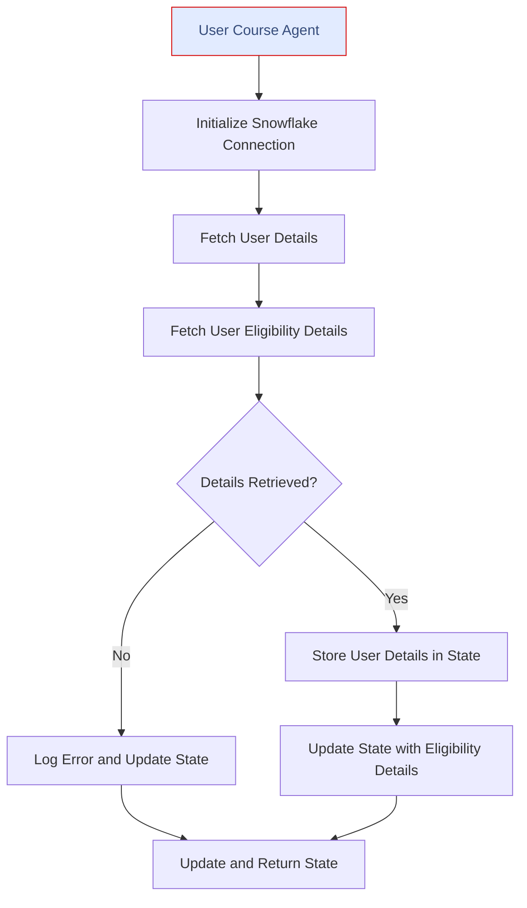
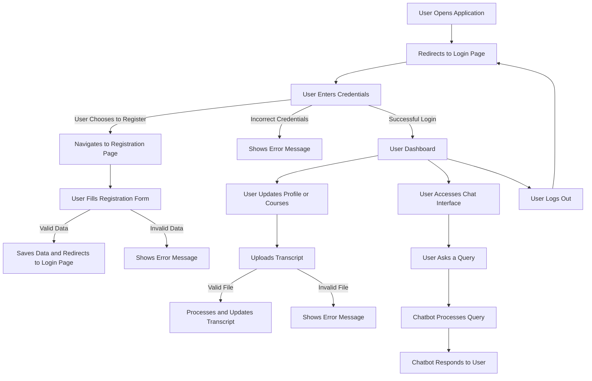

# Table of Contents

1. [Introduction](#introduction)
2. [Background](#background)
3. [Objective](#objective)
4. [Project Overview](#project-overview)
   - [Scope](#scope)
   - [Technologies](#technologies)
   - [Deliverables](#deliverables)
   - [Stakeholders](#stakeholders)
5. [Problem Statement](#problem-statement)
   - [Current Challenges](#current-challenges)
   - [Opportunities](#opportunities)
6. [Technologies and Tools](#technologies-and-tools)
7. [Architecture Diagram](#architecture-diagram)
8. [Data Storage Design](#data-storage-design)
   - [Snowflake Tables](#snowflake-tables)
   - [Pinecone Indexing](#pinecone-indexing)
9. [Airflow Pipelines](#airflow-pipelines)
   - [Pipeline 1: neu_data_ingestion_and_processing_pipeline](#pipeline-1-neu_data_ingestion_and_processing_pipeline)
   - [Pipeline 2: collect_and_merge_class_data](#pipeline-2-collect_and_merge_class_data)
10. [AI Agents and Tools](#ai-agents-and-tools)
    - [Task Detection Agent](#task-detection-agent)
    - [Response Construction Agent](#response-construction-agent)
    - [General Information Agent](#general-information-agent)
    - [Course Description Agent](#course-description-agent)
    - [SQL Agent](#sql-agent)
    - [User Course Agent](#user-course-agent)
11. [Methodology](#methodology)
    - [User Flow Perspective](#user-flow-perspective)
12. [Proof of Concept](#proof-of-concept)
    - [Web Scraping](#web-scraping)
    - [Transcript Processing](#transcript-processing)
    - [Eligibility Table Update](#eligibility-table-update)
13. [CI/CD](#cicd-pipeline)
14. [Project Timeline](#project-timeline)
    - [Phase 1: Foundation Setup](#phase-1-foundation-setup-november-24---november-30-2024)
    - [Phase 2: Core Agent Development](#phase-2-core-agent-development-december-1---december-5-2024)
    - [Phase 3: Data Pipelines and Processing](#phase-3-data-pipelines-and-processing-december-5---december-6-2024)
    - [Phase 4: Finalization and Documentation](#phase-4-finalization-and-documentation-december-6---december-7-2024)
    - [Phase 5: CI/CD, Testing, and Deployment](#phase-5-cicd-testing-and-deployment-december-8---december-10-2024)
15. [Challenges Faced and Solutions](#challenges-faced-and-solutions)
16. [Outcomes and Benefits](#outcomes-and-benefits)
    - [Outcomes](#outcomes)
    - [Benefits](#benefits)
17. [Conclusion](#conclusion)
18. [Addressing Feedback from Project Proposal](#addressing-feedback-from-project-proposal)
19. [References](#references)
20. [Main Data Sources](#main-data-sources)
21. [Other Data Sources](#other-data-sources)

# Introduction
In simple words:  
A multi-agent chatbot for a Northeastern University graduate student, enabling them to plan courses based on their interests, check eligibility for the upcoming semester, and inquire about general information regarding the college.

## Background
Students often face difficulties finding the right course due to:  
- **Program restrictions:** Prerequisites and core requirements.  
- **Course availability:** If the course is offered during the semester.  
- **Seat allocation:** Total seats and seat availability.  
- **Class timings:** Scheduling conflicts.  
- **Campus location:** Classes offered at different campuses.  

## Objective
Our project aims to address these challenges by suggesting courses that align with the student’s interests, program requirements, and academic progress.

# Project Overview

## Scope
**Application Focus:**  
The platform is tailored for graduate students enrolled at Northeastern University.
**Data Sources:**  
Northeastern University websites (refer to references for links).

## Technologies
- **Pipelines:** Apache Airflow.  
- **Web Scraping:** Selenium and BeautifulSoup.  
- **Embedding Generation:** NVIDIA embedding models.  
- **Storage:** Snowflake and Pinecone.  
- **LLM:** OpenAI models.  
- **Transcript Processing:** Amazon Textract.  
- **Multi-Agent Framework:** LangGraph.  
- **Backend:** FastAPI.  
- **Frontend:** Streamlit.  
- **Deployment:** Docker and GCP VM Instances.  
- **CI/CD:** GitHub Actions.

## Deliverables
1. **Multi-user application** with JWT authentication.  
2. Frontend and backend deployed on **GCP**.  
3. **General information and course suggestion chatbot**.

## Stakeholders
- **Primary users:** Graduate students at Northeastern University.  
- **Secondary users:** University staff and faculty seeking student assistance.

# Problem Statement

## Current Challenges
1. Information is scattered across multiple websites, making it difficult for students to find relevant details.  
2. There is no current system providing course suggestions or eligibility checks for students.

## Opportunities
1. Improve student experience in course selection.  
2. Provide information about courses available for upcoming semesters.  
3. Develop a scalable solution that can be extended to other institutions.

# Technologies and Tools

- **Poetry:** For dependency and library management.  
- **Selenium & BeautifulSoup:** For scraping data from university websites.  
- **Snowflake:** For storing course catalog, classes, program requirements, core and elective requirements, user profiles, and eligibility data.  
- **Pinecone:** For indexing course descriptions, prerequisites, and other metadata.  
- **Amazon Textract:** For processing user transcripts.  
- **Amazon S3:** For storing user transcripts.  
- **NVIDIA Embedding Model:** For embedding course data into Pinecone.  
- **LangGraph:** For agentic architecture.  
- **OpenAI Models:** For language understanding and question-answering.  
- **Airflow:** For pipeline scheduling.  
- **FastAPI:** For backend development.  
- **Streamlit:** For frontend development.  
- **Docker:** For containerizing applications.  
- **Google Cloud Platform:** For deploying frontend and backend on VM instances.

# Architecture Diagram

The above diagram provides an overview of the architecture for the NEU Student Assistance Chatbot (NEU-SAC), showcasing the integration of various technologies and components.

# Data Storage Design

Refer to the data sources mentioned in the reference section for more details.

## Snowflake Tables

## Pinecone Indexing

### Course Catalog Indexing

**Chunk Content:**  
- `course_name`  
- `description`  

**Metadata:**  
Each course is stored with detailed metadata:  
- `course_code`: Unique course identifier (e.g., "INFO 5100").  
- `course_name`: Name of the course.  
- `description`: Course description or "No description available".  
- `prerequisites`: Prerequisites for the course or "None".  
- `corequisites`: Corequisites for the course or "None".  
- `credits`: Number of credits assigned to the course.  
- `subject_code`: Subject code of the course (e.g., "INFO").  

### FAQ Indexing
**Chunk Content:**  
FAQs are divided into individual questions and answers, indexed as separate chunks.

**Metadata:**  
Each chunk includes:  
- `question`: The FAQ question.  
- `answer`: The corresponding answer.  
- `links`: Relevant links included in the response (if any).  

### Graduation/Commencement Indexing
**Chunk Content:**  
Information related to graduation processes and commencement.

**Metadata:**  
Each chunk includes:  
- `section_title`: Title of the section (e.g., "Graduation Clearance Procedures").  
- `content_summary`: Summary of the content in that section.  
- `links`: Links to relevant forms or resources.  

### Resources Indexing
**Chunk Content:**  
Details about student resources available at NEU.

**Metadata:**  
Each chunk includes:  
- `title`: Resource title (e.g., "Student Wellbeing Resources").  
- `description`: Brief description of the resource.  
- `links`: URLs to access these resources.  

# Airflow Pipelines

## Pipeline 1: neu_data_ingestion_and_processing_pipeline

This pipeline orchestrates the setup of Snowflake, scraping and ingestion of course catalog data, and processing of additional university resources (e.g., FAQs, graduation information).

### Key Sections:
1. **Snowflake Setup**:  
   Initializes the Snowflake database, schema, and tables.
   
2. **Program Requirements Loading**:  
   Loads program requirements data into the `PROGRAM_REQUIREMENTS` table.

3. **Class Data Loading**:  
   Inserts merged class data from S3 into the Snowflake `CLASSES` table.

4. **Course Catalog Management**:  
   - Scrapes course catalog data and stores it in S3.  
   - Loads course catalog data into Snowflake.  
   - Processes and indexes course data in Pinecone.

5. **Resource Processing**:  
   - Scrapes and indexes university resource information.  
   - Scrapes and indexes graduation information.  
   - Scrapes and indexes FAQs.

### Outputs:
- Snowflake tables populated with program requirements, class data, and course catalog.  
- Course catalog data indexed in Pinecone for semantic search.  
- Indexed university resources (FAQs, graduation information) in Pinecone.

## Pipeline 2: collect_and_merge_class_data

This pipeline automates the collection of class data for multiple semesters, merges the collected data, and saves it in a structured format.

### Key Sections:
1. **collect_fall_2023**:  
   Collects data for the Fall 2023 semester.

2. **collect_spring_2024**:  
   Collects data for the Spring 2024 semester.

3. **collect_fall_2024**:  
   Collects data for the Fall 2024 semester.

4. **collect_spring_2025**:  
   Collects data for the Spring 2025 semester.

5. **merge_semester_data**:  
   Merges all semester files into a single dataset.

### Outputs:
- Individual semester data stored in S3 as CSV files.  
- A merged dataset containing all class data across semesters, also stored in S3.

# AI Agents and Tools

## Task Detection Agent

**Purpose:**  
The Task Detection Agent analyzes the user's query and determines the appropriate agents or "nodes" needed to address it. It acts as the decision-making component that routes tasks to the right agents based on the user's intent and context.

### Responsibilities:
1. **Analyze User Query:**  
   Understand the user's question or request using the latest query and chat history.

2. **Determine Nodes to Visit:**  
   Identify which nodes (e.g., `course_description`, `sql_agent`, `user_course_agent`, `general_information`) should be visited to fulfill the query.

3. **Keyword Generation:**  
   Generate relevant keywords for `course_description` if needed.

4. **Generate Generalized Description:**  
   Provide a concise and generalized summary of the query for `general_information` if needed.

### Output:
- **Nodes to Visit:** A list of nodes (e.g., `sql_agent`, `user_course_agent`) required to handle the query.
- **Course Description Keywords:** Keywords for searching course descriptions, if applicable.
- **General Description:** A summarized and generalized version of the user's query.

## Response Construction Agent

**Purpose:**  
Aggregates outputs from various agents and formats the final response for the user. It synthesizes information from multiple sources (e.g., SQL query results, user course details, general information) to generate a clear, actionable, and user-friendly final response.

### Responsibilities:
1. **Query Context Awareness:**  
   Understand the nature of the query (e.g., course eligibility, program requirements, general inquiries).

2. **Eligibility Validation:**  
   Use SQL results and user course details to validate the user's eligibility for courses, including checking prerequisites and program progress.

3. **General Information Responses:**  
   Use general information results for non-specific queries (e.g., campus policies, enrollment procedures).

4. **Construct Clear Responses:**  
   Provide eligibility statements or actionable recommendations based on the user's academic history and query context.

### Output:
- **Final Response:** A concise, accurate, and actionable response tailored to the user's query.

## General Information Agent

**Purpose:**  
The General Information Agent retrieves relevant general information in response to user queries. It leverages pre-embedded data (via Pinecone) and external resources (via Tavily) to provide accurate and domain-specific information.

### Responsibilities:
1. **Query Understanding:**  
   Retrieve the generalized description of the query from the system state.

2. **Pinecone Search:**  
   - Use the NVIDIA embeddings model to generate vector embeddings for the query.  
   - Search the Pinecone index (`general-information-index`) for matches based on the query embedding.  
   - Retrieve the top results with metadata and relevance scores.

3. **Relevance Filtering:**  
   Apply a relevance threshold to filter out less relevant Pinecone results. If no results meet the threshold, fallback to the Tavily search.

4. **Tavily Search Fallback:**  
   Conduct a web search using Tavily, restricted to domains related to Northeastern University (e.g., `northeastern.edu`).

### Output:
- **State Updates:** `general_information_results`

## Course Description Agent

**Purpose:**  
The Course Description Agent retrieves course codes and names from the `course-catalog-index` (Pinecone index) where course descriptions are stored as vectors. It provides information about courses that match the user's query or interest areas.

### Responsibilities:
1. **Keyword Handling:**  
   - Retrieve keywords for the course description search from the system state (`course_description_keywords`).  
   - Construct a query string by combining the keywords.

2. **Pinecone Search:**  
   - Use the NVIDIA embeddings model to generate a query embedding based on the constructed keyword query string.  
   - Query the Pinecone index (`course-catalog-index`) using the generated embedding.  
   - Retrieve the top k matches (default: 5) with associated metadata.

3. **General Information Responses:**  
   Use general information results for non-specific queries (e.g., campus policies, enrollment procedures).

4. **Construct Clear Responses:**  
   Provide eligibility statements or actionable recommendations based on the user's academic history and query context.

### Output:
- **State Updates:** `course_description_results`

## SQL Agent

**Purpose:**  
The SQL Agent generates, executes, and manages SQL queries to extract precise information from a Snowflake database. It ensures queries are tailored to user queries while adhering to the schema, optimizing performance, and handling query failures gracefully.

### Responsibilities:
1. **SQL Query Generation:**  
   Create SQL queries using OpenAI's LLM (via ChatOpenAI) based on user queries, chat history, database schema, and course codes.

2. **Database Schema Management:**  
   Dynamically retrieve and incorporate the schema details of relevant tables for query generation and correction.

3. **Query Execution:**  
   Execute the generated SQL queries using the Snowflake database connection.

4. **Error Classification and Correction:**  
   - Classify errors (e.g., syntax errors, invalid identifiers, permissions issues).  
   - Automatically correct syntax or structural issues in the query based on the error type and schema.

5. **Retry Logic:**  
   Retry failed queries with corrections up to a maximum number of attempts.

6. **Context Awareness:**  
   - Utilize context-specific parameters like user program name, campus, and credits left for user-specific queries.  
   - Integrate semantic matches (relevant course codes) from previous agents to focus query scope.

### Output:
- **State Updates:** `generated_query`, `sql_results`

## User Course Agent

**Purpose:**  
The User Course Agent fetches and processes user-specific course and program information from the database. It focuses on retrieving details such as the user's academic progress, program details, and calculated eligibility table.

### Responsibilities:
1. **User Details Retrieval:**  
   Fetch details such as GPA, completed credits, remaining credits, program name, campus, and college.

2. **User Eligibility Retrieval:**  
   Query the `USER_ELIGIBILITY` table to fetch the user’s eligibility for courses, programs, or requirements.

### Output:
- **State Updates:** `user_details`, `user_course_details`

# Methodology

## User Flow Perspective

The following steps illustrate the overall methodology of how the system processes user inputs and provides outputs:

1. **Amazon Textract Processing:**  
   - Users upload their transcripts in PDF format.  
   - The transcripts are processed using **Amazon Textract** to extract relevant information such as:  
     - Completed courses.  
     - Grades achieved.  
     - Credits earned.  

2. **Eligibility Table Update:**  
   - The extracted data from the transcripts is used to populate the `USER_ELIGIBILITY` table in Snowflake.  
   - This table acts as the foundation for:  
     - Personalized course recommendations.  
     - Automated eligibility checks for upcoming courses.  

These processes ensure the system delivers tailored course suggestions and eligibility validations to enhance the user experience.

# Proof of Concept

## Web Scraping

Web scraping for most websites is straightforward as the links are dynamic. However, for the course registration page, the web link is static, requiring the use of **Selenium** and **Python** to navigate the page and extract relevant information. 

Below is a code snippet demonstrating the approach:  

## Transcript Processing

Unofficial student transcripts from Northeastern University were tested with **Amazon Textract** to extract tables of completed courses, grades, and credits. The processing worked as expected.  

Below is an example of the extracted data:  

## Eligibility Table Update

The `USER_ELIGIBILITY` table is populated by processing the `USER_COURSES` data and checking program-specific requirements. Here’s an example calculation for **User 1** (enrolled in the Information Systems MS program):  

### Input: `USER_COURSES` Table  

### Output: Generated `USER_ELIGIBILITY` Entries  

# CI/CD Pipeline

This CI/CD pipeline uses **GitHub Actions** to automate testing, building, and deploying the NEU-SAC application. It ensures that changes pushed to the `main` branch are tested, containerized, and deployed to **Google Cloud Platform (GCP)**.

## Workflow Trigger

The pipeline runs automatically:
- When code is pushed to the `main` branch.
- When a pull request is opened for the `main` branch.

## Key Pipeline Steps

### 1. Testing
- Tests the **backend** and **airflow_docker_pipelines** services.
- Steps involved:
  - **Check out the code:** Clones the repository to the GitHub Actions runner.
  - **Set up Python 3.12:** Ensures the correct Python environment is available.
  - **Install dependencies:** Uses **Poetry** to install all required libraries.
  - **Run unit tests:** Executes tests with **pytest** to validate the application.

### 2. Building Docker Images
- Builds Docker images for:
  - **Backend**
  - **Airflow Docker Pipelines**
  - **Frontend**
- Steps involved:
  - Builds images using **Docker** with versioning tags based on the Git commit hash or branch name.
  - Pushes the built images to **Docker Hub** for easy access and deployment.

### 3. Deployment to GCP
- Connects to the GCP Virtual Machine using **SSH**.
- Deployment process:
  - Pulls the latest Docker images from **Docker Hub**.
  - Stops any running containers for the services being updated.
  - Deploys updated services with the pulled Docker images.
  - Configures the backend to run on port `8000` and the frontend to run on port `8501`.
  - Injects all necessary environment variables securely from **GitHub Secrets**.

---

## Advantages of the Pipeline

- **Automation:** Eliminates manual intervention for testing, building, and deploying, ensuring consistency and reducing errors.
- **Efficiency:** Ensures only tested and containerized code is deployed to production.
- **Security:** Environment variables and sensitive credentials are securely managed through **GitHub Secrets**.
- **Scalability:** Can easily extend to include additional services or environments as the application evolves.

# Project Timeline

## Phase 1: Foundation Setup (November 24 - November 30, 2024)

**Focus:**  
Initial architecture, scraping scripts, Snowflake setup, and minimal frontend/backend functionality.

**Tasks:**  
- Multi-Agent Architecture Planning & Workflow Design.  
- Setting up Snowflake database, S3, Pinecone integration.  
- Web scraping scripts for NU Banner, Course Catalog, Graduate Resources, and FAQ.  
- Basic frontend (Login, Register) and backend authentication (JWT) setup.  
- Process transcript extraction using Amazon Textract.  

## Phase 2: Core Agent Development (December 1 - December 5, 2024)

**Focus:**  
Develop core agents for functionality and backend integration.

**Tasks:**  
- Task Execution Agent for managing workflows.  
- General Information Agent and Course Description Agent.  
- SQL Agent and User Course Agent for handling user-specific queries.  
- Response Construction Agent for composing final responses.  
- Enhanced eligibility calculation logic.  

## Phase 3: Data Pipelines and Processing (December 5 - December 6, 2024)

**Focus:**  
Build Airflow pipelines for data ingestion and processing.

**Tasks:**  
- Setup Airflow with Docker and implement two pipelines:  
  - **Pipeline 1:** Load program requirements, class data, and course catalog into Snowflake and Pinecone.  
  - **Pipeline 2:** Scrape NU Banner data and store it in Pinecone.  
- Test and ensure seamless data flow into Snowflake, S3, and Pinecone.  

## Phase 4: Finalization and Documentation (December 6 - December 7, 2024)

**Focus:**  
Finalize the application, resolve defects, and create documentation.

**Tasks:**  
- Create README files for Frontend, Backend, and Airflow pipelines.  
- Restructure and finalize diagrams for better clarity.  
- Resolve complex query defects and improve prompt handling.  
- Document workflows in codelabs format.  

## Phase 5: CI/CD, Testing, and Deployment (December 8 - December 10, 2024)

**Focus:**  
Automate deployment and perform rigorous testing.

**Tasks:**  
- Create Docker images for all services.  
- Set up CI/CD pipelines for GCP deployment.  
- Perform end-to-end testing to ensure stability and performance.  
- Deploy the application on GCP and finalize improvements based on feedback.  

## Resources and Team

**Team Members:**  
- Dharun Karthick Ramaraj  
- Linata Rajendra Deshmukh  
- Nikhil Godalla  

**Project Work Plan:**  
Available on GitHub: [Project Plan](https://github.com/orgs/BigDataIA-Fall2024-Team-5/projects/13)

# Challenges Faced and Solutions

### 1. SQL Table Data Format  
**Challenge:**  
Initially, the planned format for SQL tables was not detailed enough to support the complex queries required for eligibility calculations and course recommendations.  

**Solution:**  
We redesigned the table schemas to include additional fields to handle complex queries efficiently.

### 2. General Information Agent Fallback Strategy  
**Challenge:**  
Initially, we planned a standalone web agent for retrieving general information. However, this approach was inefficient in terms of performance and accuracy.  

**Solution:**  
We integrated the web agent functionality into the General Information Agent. If no relevant results are found in the Pinecone index, the agent performs a targeted web search within the `northeastern.edu` domain. This significantly improved the overall performance and relevance of responses.

# Outcomes and Benefits

## Outcomes

1. **Improved Course Planning:**  
   Students can receive personalized course recommendations based on their academic progress, interests, and program requirements.

2. **Eligibility Validation:**  
   Automated checks ensure students are informed of their eligibility for courses, including prerequisites and program-specific restrictions.

3. **Integrated Information Access:**  
   Combines data from multiple university resources, including program requirements, course catalogs, and class schedules, into a single platform.

4. **Enhanced User Experience:**  
   A user-friendly chatbot interface streamlines the process of finding relevant courses, checking seat availability, and accessing academic policies.

5. **Scalable Multi-Agent System:**  
   A modular and scalable architecture ensures the platform can be extended to accommodate additional features or other educational institutions.

## Benefits

1. **Time-Saving:**  
   Students save significant time by avoiding manual searches across multiple university websites for course and eligibility information.

2. **Personalized Guidance:**  
   Tailored recommendations help students plan their academic paths effectively, aligning with their career goals and program requirements.

3. **Real-Time Support:**  
   The chatbot provides instant answers to general queries about Northeastern University, ensuring students are always informed.

4. **Future Scalability:**  
   With its robust backend and multi-agent system, the platform can be expanded to include additional functionalities such as co-op tracking, advisor recommendations, or cross-departmental collaborations.

5. **Cost Efficiency for University:**  
   By reducing the need for manual support from university staff for common student queries, the platform offers an efficient, automated alternative.

6. **Support for New Students:**  
   A simplified course selection process and clear guidance make it easier for newly admitted students to navigate their academic journey.

# Conclusion

The Northeastern University Student Assistance Chatbot (NEU-SAC) is designed to make life easier for graduate students. It helps with planning courses, checking eligibility, and finding answers to common questions about the university—all in one place.

By combining the right tools and technologies, we’ve created a solution that takes the hassle out of searching through multiple websites and resources. It’s simple, user-friendly, and focused on what students actually need.

We’ve worked hard to address challenges and incorporate feedback to make the chatbot better. It’s a small step, but we believe it’s a meaningful one to improve the experience for Northeastern students.

# Addressing Feedback from Project Proposal

## Feedback 1: Detail how students are informed about courses across departments, and enable users to upload transcripts to assess prerequisites.
**Response:**  
When a user uploads a transcript in PDF format, it is processed using **Amazon Textract** to extract details such as course, grade, and credits. The extracted data is stored in **Snowflake** and compared with eligibility criteria to recommend suitable subjects. Courses from electives are also accounted for, ensuring they align with credit requirements.

## Feedback 2: Specify agents and their tools.
**Response:**  
The system uses a multi-agent architecture to handle different tasks efficiently:  
1. **Task Detection Agent:**  
   - Serves as the primary orchestrator, analyzing user queries to determine their intent and routing them to appropriate agents.  

2. **General Information Agent:**  
   - Handles FAQs and performs semantic searches.  
   - Falls back to web search within the `northeastern.edu` domain if no relevant match is found in the Pinecone index.

3. **Course Description Agent:**  
   - Utilizes the indexed course catalog in Pinecone, containing course names and descriptions in chunks.  
   - Retrieves course metadata such as course code, course name, and course description for further processing.  

4. **SQL Agent:**  
   - Retrieves structured data from Snowflake, including course schedules, program details, instructors, and room locations.  

5. **User Course Agent:**  
   - Fetches user-specific details such as completed courses, GPA, and credits from Snowflake.  
   - Provides necessary data for eligibility decisions and personalized recommendations.  

6. **Response Construction Agent:**  
   - Aggregates data from various agents and constructs a comprehensive, user-friendly response.  

## Feedback 3: News Scraping: Justify its relevance to course selection.
**Response:**  
Our application focuses on assisting students with course selection, registration, and academic planning. Scraping news data is not part of the current implementation, as our primary goal is to enhance the academic experience for students. While this feature is not included in the current scope, it can be considered for future enhancements.

## Feedback 4: S3 Storage: What textual data is being stored, and how?
**Response:**  
Currently, S3 contains:  
- **Transcripts:** Stored as PDFs.  
- **Course catalog data and semester-wise class information:** Stored as CSV files.  
No raw textual data is directly stored in S3.

## Feedback 5: NVIDIA Embeddings: Explain their choice for the project.
**Response:**  
We chose **NVIDIA NV-Embed** because we have used it in previous projects, and it has performed well with similar data for semantic search. Its proven reliability and compatibility with our requirements made it the preferred choice.

## Feedback 6: Include a feature to show course prerequisites to help students plan their schedules better.
**Response:**  
Yes, the feature to display course prerequisites is included as part of the subject recommendation process.  
- When students search for a course, the **SQL Agent** retrieves prerequisite details from the course catalog stored in Snowflake.  
- The **User Course Agent** fetches user-specific details, such as completed courses, GPA, and credits.  
- By combining this data, the system evaluates eligibility, and the **Response Construction Agent** aggregates data to construct a user-specific response.

## Feedback 7: Consideration of course registration preferences and alternate course suggestions.
**Response:**  
- Our application plans to show seat information alongside course details.  
- During peak times (e.g., course registration), real-time seat information might not always be accurate due to heavy traffic on Northeastern's site.  
- While it is technically feasible to implement, our project timeline limits the inclusion of this functionality. For now, we focus on providing accurate course recommendations and eligibility validation.  
- Alternate course suggestions based on user preferences and program requirements are included, offering similar options if a user's preferred course is unavailable.

# References

## General Documentation
- [Apache Airflow Documentation](https://airflow.apache.org/docs)  
- [FastAPI Documentation](https://fastapi.tiangolo.com)  
- [Snowflake Documentation](https://docs.snowflake.com)  
- [AWS S3 - Getting Started](https://aws.amazon.com/s3/getting-started)  
- [Pinecone Vector Database Documentation](https://docs.pinecone.io)  
- [OpenAI API Documentation](https://platform.openai.com/docs)  
- [Docker Documentation](https://docs.docker.com/)  
- [GitHub Repository Best Practices](https://guides.github.com/features/wikis/)  
- [Streamlit Documentation](https://docs.streamlit.io/)  
- [Amazon Textract Documentation](https://docs.aws.amazon.com/textract/)  

## Main Data Sources
- [Course Registration Platform](https://nubanner.neu.edu/StudentRegistrationSsb/ssb/registration)  
- [Course Catalog](https://catalog.northeastern.edu/course-descriptions/)  
- [Program Requirements (Sample for One Program)](https://catalog.northeastern.edu/graduate/engineering/multidisciplinary/information-systems-msis/#programrequirementstext)  

## Other Data Sources
- [Graduate Resources](https://coe.northeastern.edu/academics-experiential-learning/graduate-school-of-engineering/graduate-student-services/university-graduate-resources/)  
- [FAQ for Students](https://coe.northeastern.edu/academics-experiential-learning/graduate-school-of-engineering/graduate-student-services/faqs-for-newly-admitted-and-current-students/)  
- [Graduation Commencement](https://coe.northeastern.edu/academics-experiential-learning/graduate-school-of-engineering/graduate-student-services/graduation-commencement/)  
